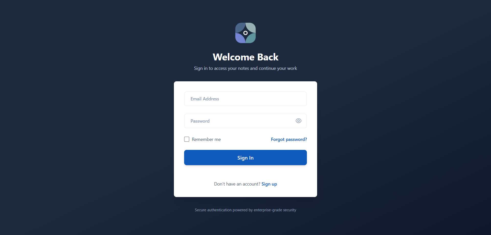
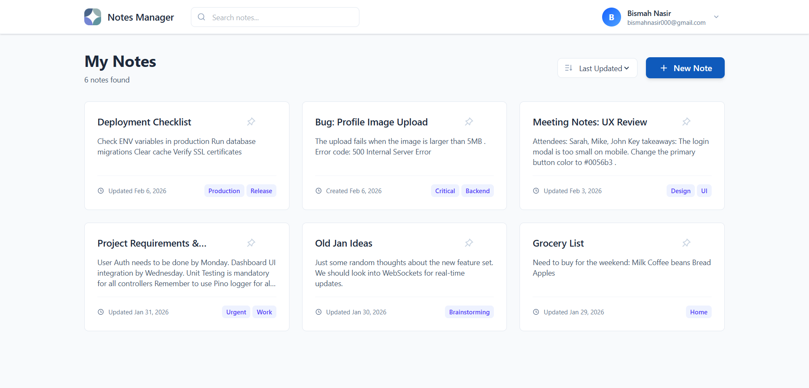
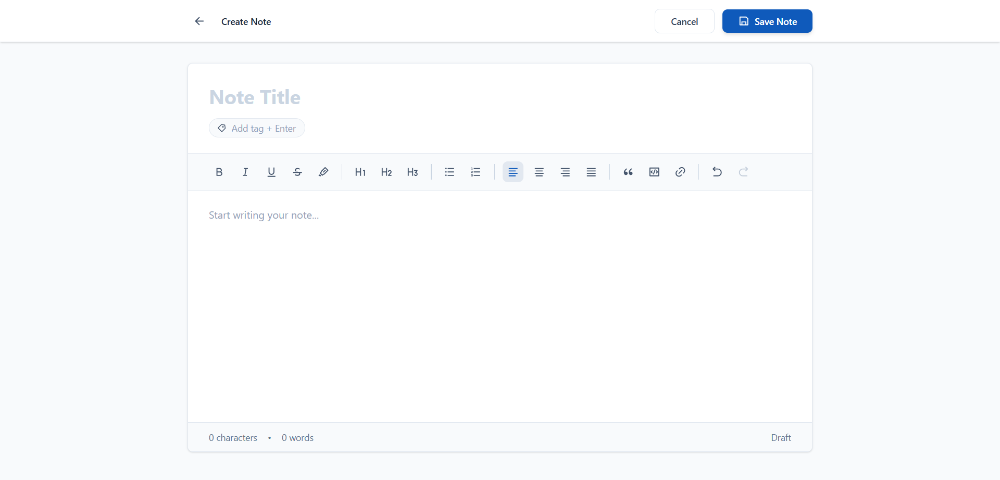
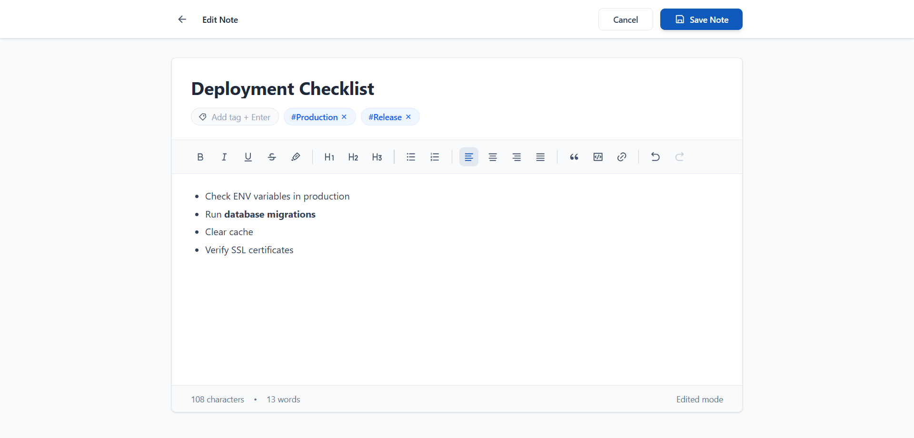
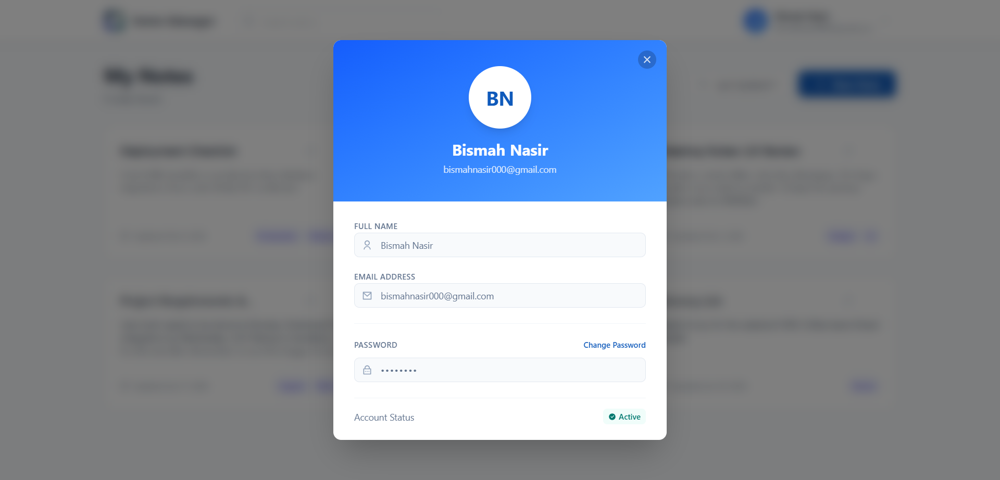

# 📝 MERN Notes Manager

A robust, full-stack application for managing personal notes securely and efficiently. Built with the MERN stack (MongoDB, Express, React, Node.js), this project emphasizes clean architecture, comprehensive testing, and high code quality standards.

---

## 🚀 Features

### 🌟 Core Functionality
- **User Authentication:** Secure Sign Up, Login, and Logout using JWT (JSON Web Tokens).
- **CRUD Operations:** Create, Read, Update, and Delete notes seamlessly.
- **Search & Filter:** Real-time search functionality to find notes instantly.
- **Pinning System:** Pin important notes to the top of the dashboard.
- **Tagging:** Organize notes with custom tags.
- **Sorting:** Sort notes by creation date or last updated.

### 🛡️ Security & Architecture
- **Password Security:** Passwords hashed using `bcryptjs`.
- **Global Error Handling:** Centralized middleware for consistent error responses and stack trace protection.
- **Structured Logging:** Backend logging using `Pino` for better debugging and performance.
- **Secure Routes:** Protected API endpoints ensuring data privacy.
- **Password Reset:** Secure email-based "Forgot Password" flow with token expiration.

### 🎨 Frontend Experience
- **Responsive Design:** Built with **Tailwind CSS** for mobile-first adaptability.
- **Interactive UI:** Smooth transitions and modals for a native app feel.
- **Toast Notifications:** Real-time success/error feedback using `react-hot-toast`.

---

## 🛠️ Tech Stack

| Domain | Technologies |
| :--- | :--- |
| **Frontend** | React (Vite), Tailwind CSS, React Router DOM, React Icons, Fetch |
| **Backend** | Node.js, Express.js, Mongoose, JWT, Bcrypt, Dotenv, Nodemailer |
| **Database** | MongoDB Atlas |
| **Testing** | **Frontend:** Vitest, React Testing Library <br> **Backend:** Mocha, Chai, Sinon |
| **Quality** | SonarQube / SonarCloud, GitHub Actions (CI/CD) |
| **Logging** | Pino (Structured Logging) |

---

## 📂 Project Structure

```bash
root/
├── backend/                # Node.js & Express Server
│   ├── config/             # DB Connection & Logger config
│   ├── controllers/        # Request Logic (User & Note)
│   ├── middleware/         # Auth & Global Error Handling
│   ├── models/             # Mongoose Schemas
│   ├── routes/             # API Routes
│   ├── utils/              # Email Sender & Helpers
│   └── tests/              # Unit & Integration Tests (Mocha/Chai)
│
├── frontend/               # React Application
│   ├── src/
│   │   ├── components/     # Reusable UI Components (Cards, Modals)
│   │   ├── pages/          # Full Pages (Home, Login, SignUp)
│   │   └── tests/          # Component Tests (Vitest)
│   └── public/             # Static Assets
│
├── .github/workflows/      # SonarCloud CI/CD Configuration
└── README.md               # Project Documentation
```

---

## ⚙️ Installation & Setup

Follow these steps to run the project locally.

### 1. Clone the Repository

```bash
git clone https://github.com/bismah-nasir/bismah-nasir-mern-10pshine.git
```

### 2. Backend Setup

Navigate to the backend folder and install dependencies:
```bash
cd backend
npm install
```

Create a `.env` file in the `backend` folder with the following variables:
```bash
PORT=5000
MONGO_URI=your_mongodb_connection_string
JWT_SECRET=your_super_secret_key
EMAIL_USERNAME=your_email@gmail.com
EMAIL_PASSWORD=your_email_app_password
```

Run the server:
```bash
npm run dev
# Server will start on http://localhost:5000
```

### 3. Frontend Setup

Open a new terminal, navigate to the frontend folder, and install dependencies:
```bash
cd frontend
npm install
```

Run the React app:
```bash
npm run dev
# App will run on http://localhost:5173
```

---

## 🧪 Testing

This project maintains high test coverage for both frontend and backend.

### Backend Tests (Mocha & Chai)

We use **Sinon** for mocking databases and middleware to ensure unit isolation.
```bash
cd backend
npm test
```

### Frontend Tests (Vitest)

We use **React Testing Library** to test components and user interactions.
```bash
cd frontend
npm test
```

---

## 📊 Quality Analysis (SonarQube)

This project is integrated with SonarCloud via GitHub Actions to ensure code quality, security, and maintainability.
- **Clean Code:** Adheres to strict linting rules.
- **Zero Bugs:** Automated scanning for potential vulnerabilities.
- **Code Coverage:** Reports generated via `nyc` (Backend) and `vitest --coverage` (Frontend).

---

## 📸 Screenshots

**Login Page**


**Home Page**


**Create New Note**


**Edit Note**


**Profile Page**


---

## 👨‍💻 Author

**Bismah Nasir**

[GitHub Profile](https://github.com/bismah-nasir)

[LinkedIn Profile](https://www.linkedin.com/in/bismah-nasir/)